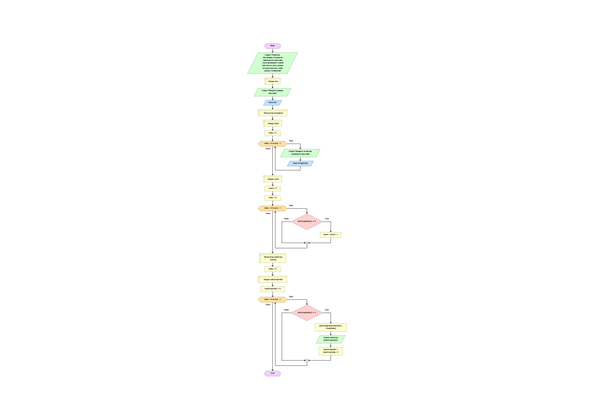

# Итоговая контрольная работа 

1. Создан репозиторий на GitHub по адресу  
https://github.com/mvelikopolskaya/Exam_First_Quater

2. Нарисована блок-схема алгоритма 

    

3. Создан файл README.md

4. Создан алгоритм решения задачи.
    
    * Пользователю предлагается определить размер первоначального массива
    * В методе создания массива пользователь вводит значения элементов первоначального массива
    * Метод печати массива выводит первоначальный массив на экран
    * Создается метод проверки элемента массива на соответствие условиям задачи (элементы массива содержат 3 или меньше символов)
    * Создается метод, определяющий размер нового массива
    * В методе создания нового массива значения элементов присваиваются после проверки методом соответствия условиям задачи
    * Метод печати выводит на экран новый массив
